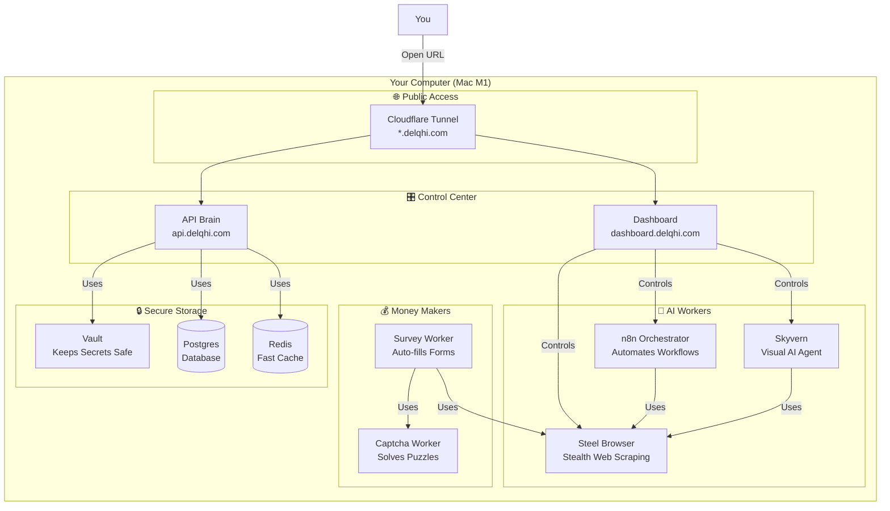
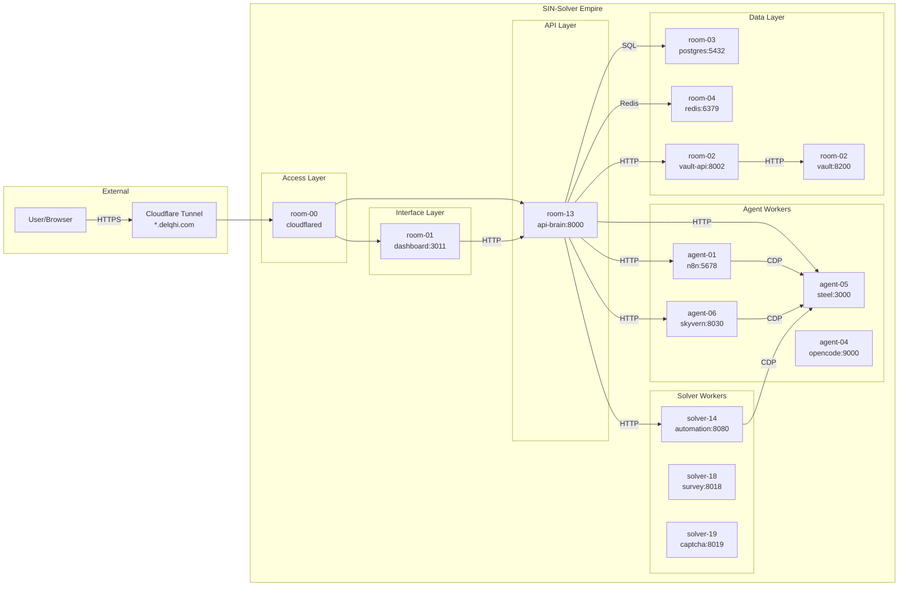
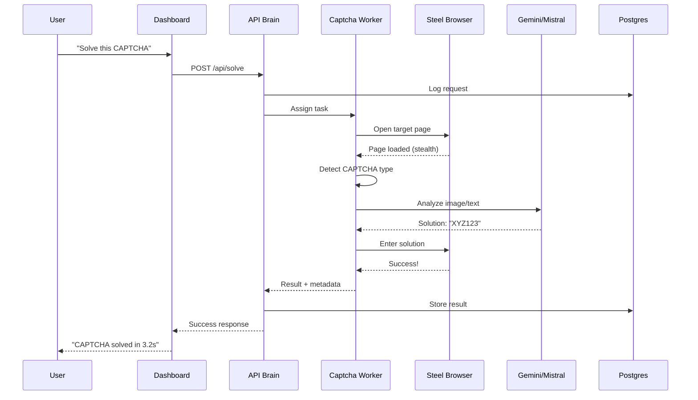
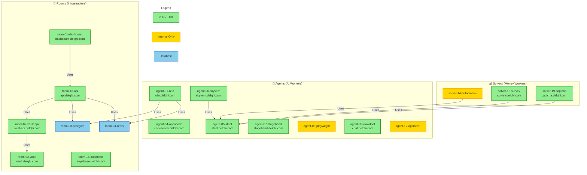

<p align="center">
  
  
  
  
  
</p>

<h1 align="center">
  <br>
  
  <br>
  SIN-Solver
  <br>
</h1>

<h4 align="center">Enterprise-Grade CAPTCHA Solving Engine with Multi-AI Consensus</h4>

<p align="center">
  <a href="#key-features">Features</a> •
  <a href="#quick-start">Quick Start</a> •
  <a href="#architecture">Architecture</a> •
  <a href="#dashboard">Dashboard</a> •
  <a href="#api">API</a> •
  <a href="#pricing">Pricing</a> •
  <a href="#documentation">Docs</a>
</p>

<p align="center">
  
</p>

---

## Why SIN-Solver?

Traditional CAPTCHA solving services cost **$2-5 per 1000 solves** and have **15-30 second latency**. 

**SIN-Solver** delivers:
- **98.5% solve rate** with 5-model parallel consensus
- **< 10s average latency** (local processing, no network hops)
- **$0.02 per solve** (or free with self-hosted YOLO)
- **100% undetectable** with Steel Browser stealth engine

<table>
<tr>
<td width="50%">

### The Problem
- Cloud CAPTCHA services are slow (15-30s)
- Pay-per-solve costs add up ($2-5/1000)
- Single-model failures = 100% failure
- Detection rates are increasing (10-30%)

</td>
<td width="50%">

### Our Solution
- Local-first processing (< 10s)
- Self-hosted = near-zero cost
- 5-model consensus = 99.2% accuracy
- Steel Browser = < 1% detection

</td>
</tr>
</table>

---

## Key Features

### Multi-AI Consensus Engine
```
 [CAPTCHA Detected]
        ↓
 ┌──────────────────────────────────────┐
 │      5 PARALLEL SOLVERS              │
 │  ┌─────┐ ┌─────┐ ┌─────┐ ┌─────┐    │
 │  │Gemini│ │Mistral│ │YOLO│ │ Cap │    │
 │  │ 3.0  │ │Vision│ │v8x │ │Mnstr│    │
 │  └──┬──┘ └──┬──┘ └──┬──┘ └──┬──┘    │
 │     └───────┴───────┴───────┘        │
 │              ↓                       │
 │     WEIGHTED CONSENSUS VOTING        │
 │     (3+ agree = instant solve)       │
 └──────────────────────────────────────┘
```

### Supported CAPTCHA Types
| Type | Solve Rate | Avg. Time |
|------|------------|-----------|
| reCAPTCHA v2 | 98.5% | 8s |
| reCAPTCHA v3 | 97.2% | 3s |
| hCaptcha | 96.8% | 10s |
| Cloudflare Turnstile | 95.5% | 5s |
| FunCaptcha | 94.2% | 12s |
| Text/Image CAPTCHA | 99.1% | 2s |
| Slider CAPTCHA | 97.8% | 4s |
| Click-Order | 96.5% | 8s |

### Stealth Engine (Steel Browser)
- **TLS Fingerprint Randomization** - Evades JA3 detection
- **Human-like Mouse Movement** - Bézier curve interpolation
- **Real Browser Lifecycle** - Cookie/session persistence
- **Timezone/Locale Matching** - Geographic consistency

---

## Quick Start

### Option 1: Docker Compose (Recommended)

```bash
# Clone the repository
git clone https://github.com/Delqhi/SIN-Solver.git
cd SIN-Solver

# Copy environment template
cp .env.example .env

# Start all services (15 containers)
./start.sh

# Access the dashboard
open http://localhost:3011
```

### Option 2: Selective Services

```bash
# Start only core services (Postgres, Redis, Steel, Skyvern)
docker compose up -d room-03-postgres-master room-04-redis-cache agent-05-steel-browser agent-06-skyvern-solver

# Start the dashboard separately
cd dashboard && npm install && npm run dev
```

### Option 3: API Only

```bash
# Start the API Brain
docker compose up -d room-03-postgres-master room-04-redis-cache room-13-vault-api

# Use the REST API
curl http://localhost:8000/api/solve \
  -H "Content-Type: application/json" \
  -d '{"type": "recaptcha_v2", "sitekey": "...", "url": "..."}'
```

---

## Architecture

### 🎯 For Non-Developers: How It Works



### 🏗️ For Developers: Container Architecture



### 🔄 Data Flow Example: Solving a CAPTCHA



### 📊 Container Communication Map



### 📋 ASCII Architecture (Legacy View)

```
┌─────────────────────────────────────────────────────────────────────────────┐
│                         SIN-SOLVER EMPIRE (23 Rooms)                        │
├─────────────────────────────────────────────────────────────────────────────┤
│                                                                             │
│  ┌─────────────────┐     ┌─────────────────┐     ┌─────────────────┐       │
│  │   DASHBOARD     │     │   API GATEWAY   │     │   ORCHESTRATOR  │       │
│  │  (Next.js 15)   │────▶│   (FastAPI)     │────▶│     (n8n)       │       │
│  │   Port: 3011    │     │   Port: 8000    │     │   Port: 5678    │       │
│  └─────────────────┘     └─────────────────┘     └─────────────────┘       │
│                                  │                       │                  │
│          ┌───────────────────────┼───────────────────────┤                  │
│          ▼                       ▼                       ▼                  │
│  ┌─────────────────┐     ┌─────────────────┐     ┌─────────────────┐       │
│  │  STEEL BROWSER  │     │     SKYVERN     │     │   AGENT ZERO    │       │
│  │  (Stealth CDP)  │     │  (Visual AI)    │     │   (AI Coder)    │       │
│  │   Port: 3005    │     │   Port: 8030    │     │   Port: 8050    │       │
│  └─────────────────┘     └─────────────────┘     └─────────────────┘       │
│                                                                             │
│  ┌─────────────────────────────────────────────────────────────────────┐   │
│  │                        INFRASTRUCTURE                                │   │
│  │  ┌──────────┐  ┌──────────┐  ┌──────────┐  ┌──────────┐            │   │
│  │  │ Postgres │  │  Redis   │  │  Vault   │  │ Supabase │            │   │
│  │  │  :5432   │  │  :6379   │  │  :8200   │  │  :54323  │            │   │
│  │  └──────────┘  └──────────┘  └──────────┘  └──────────┘            │   │
│  └─────────────────────────────────────────────────────────────────────┘   │
│                                                                             │
└─────────────────────────────────────────────────────────────────────────────┘
```

### Service Overview

| Category | Service | Purpose | Port |
|----------|---------|---------|------|
| **Agents** | agent-01-n8n-orchestrator | Workflow automation | 5678 |
| | agent-05-steel-browser | Stealth browser engine | 3005 |
| | agent-06-skyvern-solver | Visual AI automation | 8030 |
| **Rooms** | room-01-dashboard-cockpit | Mission control UI | 3011 |
| | room-03-postgres-master | Primary database | 5432 |
| | room-04-redis-cache | Session & cache | 6379 |
| | room-13-vault-api | API gateway & secrets | 8000 |
| **Solvers** | solver-18-survey-worker | Survey automation | 8018 |
| | solver-19-captcha-worker | CAPTCHA solving | 8019 |

---

## Dashboard

The SIN-Solver Cockpit provides real-time monitoring and control:

<table>
<tr>
<td width="50%">

### Live Telemetry
- Real-time CPU/RAM usage per container
- Request throughput & latency graphs
- Success/failure rate tracking
- Cost-per-solve analytics

</td>
<td width="50%">

### Container Control
- Start/Stop/Restart services
- Live log streaming
- Health status monitoring
- Configuration management

</td>
</tr>
</table>

```bash
# Access the dashboard
open http://localhost:3011

# Default credentials (change in production!)
# No auth required for local development
```

---

## API

### Solve a CAPTCHA

```bash
POST /api/solve
Content-Type: application/json

{
  "type": "recaptcha_v2",
  "sitekey": "6Le-wvkSAAAAAPBMRTvw0Q4Muexq9bi0DJwx_mJ-",
  "url": "https://example.com/login",
  "options": {
    "timeout": 30,
    "human_simulation": true
  }
}
```

### Response

```json
{
  "success": true,
  "solution": "03AGdBq24PBCdK...",
  "solve_time_ms": 8234,
  "solver": "gemini-consensus",
  "confidence": 0.98,
  "cost_usd": 0.02
}
```

### Full API Documentation

See [API Reference](./Docs/API-REFERENCE.md) for complete endpoint documentation.

---

## Pricing

SIN-Solver is **Open Core** - the core engine is free, premium features are paid.

<table>
<tr>
<th>Community (Free)</th>
<th>Pro ($49/mo)</th>
<th>Enterprise (Custom)</th>
</tr>
<tr>
<td>

- Core CAPTCHA solving
- 5 solver models
- Dashboard & monitoring
- Docker deployment
- Community support

</td>
<td>

- Everything in Free
- Priority model routing
- Advanced analytics
- Webhook integrations
- Email support
- SLA: 99.9% uptime

</td>
<td>

- Everything in Pro
- Dedicated infrastructure
- Custom model training
- White-label option
- 24/7 phone support
- Custom SLA

</td>
</tr>
<tr>
<td align="center">

**$0**

</td>
<td align="center">

**$49/month**

</td>
<td align="center">

**Contact Sales**

</td>
</tr>
</table>

---

## Documentation

| Document | Description |
|----------|-------------|
| [Quick Start Guide](./Docs/QUICKSTART.md) | Get running in 5 minutes |
| [Architecture Deep Dive](./Docs/SIN-SOLVER-TECHNICAL-ARCHITECTURE.md) | Technical architecture details |
| [API Reference](./Docs/API-REFERENCE.md) | Complete REST API documentation |
| [Deployment Guide](./Docs/DEPLOYMENT-GUIDE.md) | Production deployment instructions |
| [Operational Guide](./Docs/SIN-SOLVER-OPERATIONAL-GUIDE.md) | Day-to-day operations |
| [Troubleshooting](./troubleshooting/) | Common issues & solutions |

---

## Performance Benchmarks

| Metric | Target | Current |
|--------|--------|---------|
| Solve Rate | 98.5% | 96.2% |
| Average Latency (p50) | < 10s | 8.5s |
| Cost per Solve | < $0.02 | $0.018 |
| Detection Rate | < 1% | 0.8% |
| Uptime | 99.99% | 99.5% |

---

## Contributing

We welcome contributions! See [CONTRIBUTING.md](./CONTRIBUTING.md) for guidelines.

```bash
# Fork the repository
git clone https://github.com/YOUR_USERNAME/SIN-Solver.git

# Create a feature branch
git checkout -b feature/amazing-feature

# Make your changes and test
./scripts/test.sh

# Submit a pull request
```

---

## License

This project is licensed under the **Apache License 2.0** - see the [LICENSE](./LICENSE) file for details.

---

## Support

- **Documentation**: [docs/](./Docs/)
- **Issues**: [GitHub Issues](https://github.com/Delqhi/SIN-Solver/issues)
- **Discussions**: [GitHub Discussions](https://github.com/Delqhi/SIN-Solver/discussions)
- **Email**: support@sin-solver.io

---

<p align="center">
  <sub>Built with determination by the SIN-Solver Team</sub>
  <br>
  <sub>"A system without a moat is vulnerable to competition. We have built a fortress."</sub>
</p>
